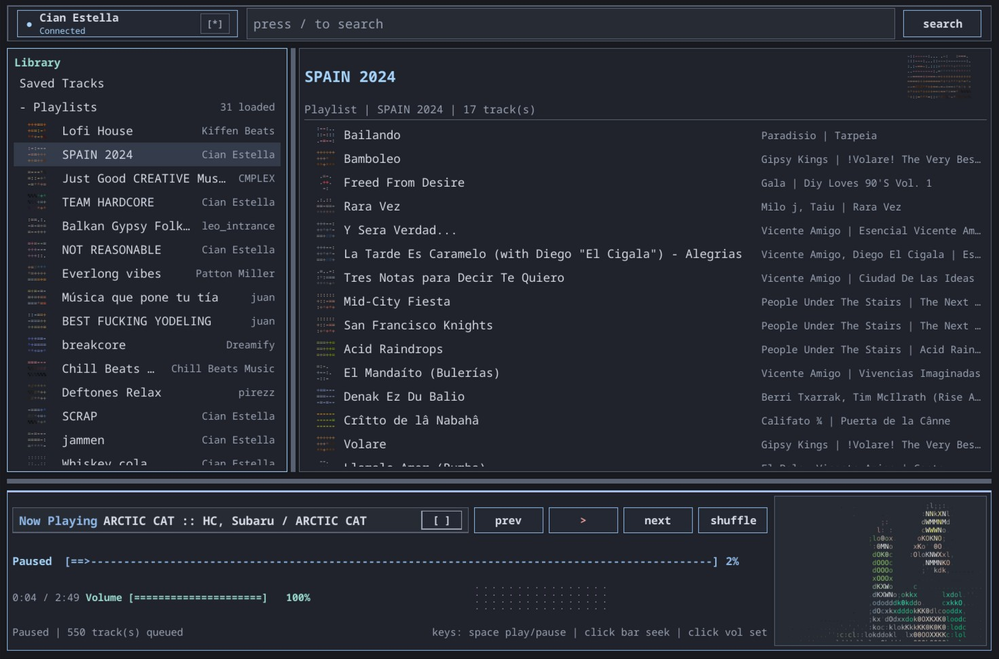

<div align="center">
  
  <h1>qtspot</h1>
  <p>Fast, native Spotify client written in Rust — low overhead, clean UI, lightweight runtime (no Electron).</p>
  <p>
    <a href="https://github.com/YummierGravy/qtspot/releases/latest">Latest Release</a>
    •
    <a href="https://github.com/YummierGravy/qtspot/issues">Issues</a>
  </p>
</div>

<p align="center">
  
</p>

## Maintainer and lineage
- qtspot is maintained by Cian Estella / YummierGravy.
- This project is a hard fork of earlier MIT-licensed Spotify client work, including the previous Spotix fork and the original psst project.
- The fork now follows its own product, packaging, UI, and maintenance direction.

## Features
- Qt 6/QML desktop interface with a compact, terminal-inspired layout.
- Spotify OAuth login, library browsing, saved tracks/albums/shows, playlists, and search.
- Native playback with queue controls, shuffle, seeking, volume, crossfade, autoplay, and saved playback restore.
- Built-in 10-band equalizer, presets, mono output, and normalization controls.
- Local audio cache with configurable size limits and cache usage controls.
- TOML themes, bundled theme presets, Spotify Mix fonts, and configurable lyrics styling.
- Playlist pagination, multi-select playlist editing, bulk remove, and select-all actions.
- Automatic retry handling for transient Spotify network timeouts and throttling.

## Status
- Early development; expect missing features and rough edges
- Requires a Spotify Premium account
- Vaidating against Linux/ Arch but should build on MacOS/ Win . More to come on that later

## Download

I will do this later, for now build it

## Build
- Rust stable (1.65.0 or newer)

### Linux dependencies
- Debian/Ubuntu: `sudo apt-get install libssl-dev libasound2-dev`
- RHEL/Fedora: `sudo dnf install openssl-devel alsa-lib-devel`

### Install from source
```shell
cargo install --locked --path qtspot-gui
# This installs the `qtspot` binary to ~/.cargo/bin/.
# On Linux, the app auto-installs its .desktop file and icons on first run,
# so it will appear in your application launcher.
# --locked ensures the pinned dependency versions are used.
```

### Optional Spotify Developer Client ID
qtspot includes a default Spotify client ID, but heavy shared usage can trigger
Spotify rate limits. If you see repeated 429 errors, create your own Spotify app:

1. Open the [Spotify Developer Dashboard](https://developer.spotify.com/dashboard).
2. Create an app and enable Web API access.
3. Add `http://127.0.0.1:8888/login` as a redirect URI.
4. Copy the generated Client ID.
5. In qtspot, open Settings -> Account and paste it into Spotify Developer Client ID.
6. Re-authenticate with Spotify.

### Build from source
```shell
cargo build
# Add --release for release builds.
```

### Run from source
```shell
cargo run -p qtspot-gui --bin qtspot
# Add --release for release builds.
```

### Build app bundle (macOS)
```shell
cargo install cargo-bundle
cargo bundle --release
```
## Highlights


### Full Caching support!


### And some more
- Up to date dependencies
- Clean codebase
- and much more...

## Built-in Themes

### Gruvbox Dark


## Theming

- Each theme file must include a `name` field (e.g. `name = "catppuccin"`) and color keys. Example:
```toml
name = "catppuccin"
base = "dark"

[colors]
grey_000 = "#cdd6f4"
grey_100 = "#bac2de"
grey_200 = "#a6adc8"
grey_300 = "#585b70"
grey_400 = "#45475a"
grey_500 = "#313244"
grey_600 = "#181825"
grey_700 = "#1e1e2e"
blue_100 = "#a6e3a1"
blue_200 = "#89b4fa"
red = "#f38ba8"
link_hot = "#ffffff14"
link_active = "#ffffff0f"
link_cold = "#00000000"
lyric_highlight = "#cba6f7"
lyric_past = "#6c7086"
lyric_hover = "#cdd6f4"
playback_toggle_bg_active = "#a6e3a1"
playback_toggle_bg_inactive = "#313244"
playback_toggle_fg_active = "#1e1e2e"
icon_color = "#8e95b4"
icon_color_muted = "#6c7086"
media_control_icon = "#cdd6f4"
media_control_icon_muted = "#a6adc8"
media_control_border = "#585b70"
status_text_color = "#bac2de"
```
- Select themes in Settings → General. Custom themes are listed by their `name`.

## Project layout
- `/spotix-core` core library (session, decoding, playback)
- `/qtspot-gui` Qt/QML GUI app — binary name: `qtspot`

## Privacy
qtspot connects only to official Spotify servers.
Credentials are not stored; a reusable token is used instead.
Cached data is stored locally and can be deleted at any time.

## Credits
- Spotix: https://github.com/skyline69/spotix
- psst: https://github.com/jpochyla/psst
- librespot: https://github.com/librespot-org/librespot
- ncspot: https://github.com/hrkfdn/ncspot
